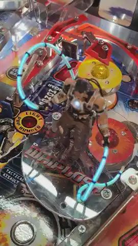

# Project description

This is a simple platform to add mods with light effects to an existing pinball machine.
The board connected to an existing lamp and once this lights up, the boards triggers its own animation. Simple as that.

Find details about hardware and firmware in their respective folders.

This project is free hardware/software, use it for your own projects if your like and let me know when you made something great!

