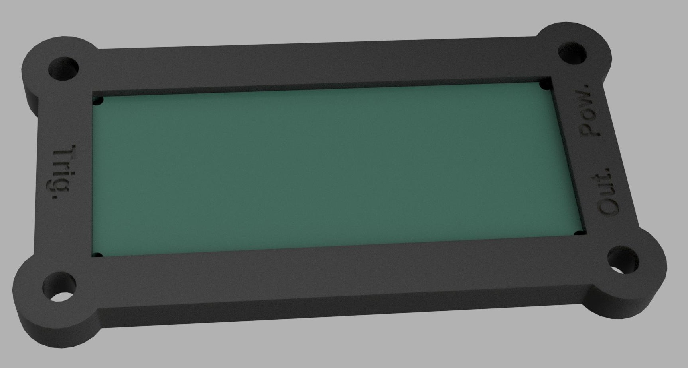

# Part description

This is a simple casing, that can be used to mount the board under the playfield using 2-4 #8 wood screws, as they are commonly found in virtually every pinball machine ever produced.

The case consist of two pieces and can be created without any special settings or support structures on practically any 3D printer.

