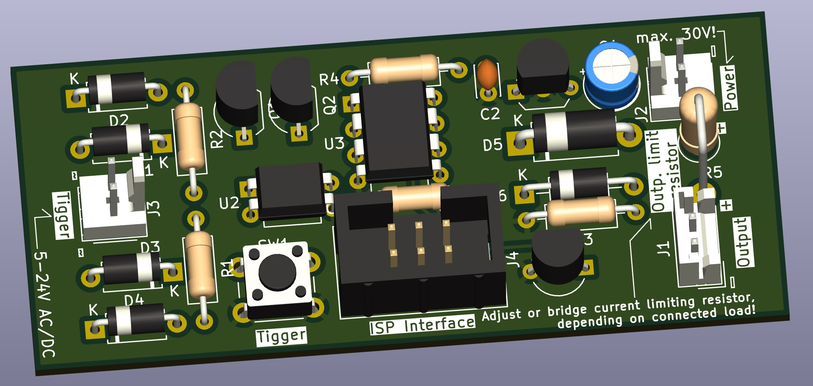

# Hardware description

The hardware is build around the `Attiny85` microcontroller (MCU), a cheap yet capable chip. To program the firmware onto the controller, an ISP (in-system programmer) is needed. You can also use something like an Arduino with the correct sketch loaded onto it.

The electronics need an external supply of 8-30V DC, reverse polarity protected local regulation is on board. The animation is triggered by an external current, the board is intended to be connected to an existing lamp and triggers as soon as this turns on. The trigger input can accept a wide voltage range of 5 to at least 24V, with no concern to polarity. For testing there is also a trigger button on the board itself that simulates an external event. Trigger input is galvanically isolated from rest of curcuit via an opto-coupler, to avoid issues with matrix switching or split power rails.

The output is connected to the board supply voltage through a current limiting resistor (R5), that has to be selected for the connected load or bridged with a jumper, if not needed. The MCU controls the output with a 12bit PWM signal, thus allowing 4096 levels of brightness with smooth fading. Output is protected against back EMF from inductive loads (e.g. EL-Wire power supply) and can supply up to 500mA of continious current.

The PCB design can either be send to a manifacturer (use the includes `Gerber-files`) or build on a commonly availible 10x23 hole proto board. Both options share the same physical board size of 30x70mm. Take a look into the interactive bill of materials `bom-folder` what for what parts need to be sourced - it also greatly helps in assembly!
